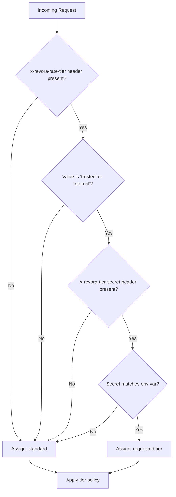

# Design Document: Rate Limiter Tier Policies

## Overview

This feature implements production-grade, multi-tier rate limiting for the Revora backend API. The design extends the existing `InMemoryRateLimitStore` and `createRateLimitMiddleware` primitives in `src/middleware/rateLimit.ts` with a tier-aware orchestration layer in `src/middleware/startupAuthRateTierPolicy.ts`.

The core security invariant is that elevated tiers (trusted, internal) are never granted based on client-supplied headers alone — they require a matching shared secret read from a server-side environment variable. Any mismatch silently downgrades the request to the standard tier, preventing clients from probing the tier resolution logic.

The implementation is already substantially complete. This design document formalizes the architecture, data models, correctness properties, and testing strategy to guide hardening, coverage completion, and future maintenance.

### Scope

The feature covers:
- Three-tier rate limit policy configuration (standard / trusted / internal)
- Tier resolution with secret-based authorization and downgrade
- Fixed-window counter enforcement with standard rate limit headers
- IP-based request keying with proxy-aware fallback
- Pluggable store interface for distributed deployments
- Configurable environment variable name for the tier secret

Out of scope: distributed Redis-backed store implementation (interface is defined; implementation is a future concern).

---

## Architecture

The rate limiting stack is composed of three layers:

```
Request
  │
  ▼
┌─────────────────────────────────────────────────────┐
│  createStartupAuthTierLimiter (orchestration layer) │
│  src/middleware/startupAuthRateTierPolicy.ts         │
│                                                     │
│  1. resolveTier(req) → 'standard' | 'trusted' |    │
│                         'internal'                  │
│  2. Sets X-RateLimit-Tier header                    │
│  3. Delegates to tier-specific limiter              │
└──────────────────┬──────────────────────────────────┘
                   │
                   ▼
┌─────────────────────────────────────────────────────┐
│  createRateLimitMiddleware (enforcement layer)      │
│  src/middleware/rateLimit.ts                        │
│                                                     │
│  1. Derives IP-based key                            │
│  2. Calls store.increment(scopedKey, windowMs)      │
│  3. Sets X-RateLimit-{Limit,Remaining,Reset}        │
│  4. Calls next() or next(AppError 429)              │
└──────────────────┬──────────────────────────────────┘
                   │
                   ▼
┌─────────────────────────────────────────────────────┐
│  InMemoryRateLimitStore (storage layer)             │
│  src/middleware/rateLimit.ts                        │
│                                                     │
│  Fixed-window counter map                           │
│  Map<string, { count: number; resetAt: number }>    │
└─────────────────────────────────────────────────────┘
```

### Tier Resolution Flow



### Key Isolation Strategy

Each tier uses a distinct `keyPrefix` to ensure counters never collide:

| Tier     | keyPrefix                  | Example scoped key                        |
|----------|----------------------------|-------------------------------------------|
| standard | `startup-auth:standard`    | `startup-auth:standard:ip:203.0.113.1`   |
| trusted  | `startup-auth:trusted`     | `startup-auth:trusted:ip:203.0.113.1`    |
| internal | `startup-auth:internal`    | `startup-auth:internal:ip:203.0.113.1`   |

A client that is downgraded from trusted to standard consumes from the standard counter, not the trusted counter. This prevents a downgraded client from exhausting the trusted tier's quota.

---

## Components and Interfaces

### `RateLimitStore` (interface)

```typescript
export interface RateLimitStore {
  increment(key: string, windowMs: number): { count: number; resetAt: number };
  reset(key: string): void;
  clear?(): void;
}
```

The `increment` method is the only method called during normal request processing. `reset` and `clear` are test helpers. Implementations must be safe to call concurrently within a single Node.js event loop tick (no async required for in-memory).

### `InMemoryRateLimitStore` (class)

Implements `RateLimitStore` using a `Map<string, WindowEntry>`. Fixed-window semantics: a window entry is created on first access and reused until `resetAt` is exceeded. On expiry, a new window is created with `count = 1`.

### `createRateLimitMiddleware` (factory)

Accepts `RateLimitOptions & { store?: RateLimitStore }`. Returns an Express `RequestHandler`. Responsible for:
- Key derivation (IP-based or user-based)
- Counter increment via store
- Header setting (`X-RateLimit-Limit`, `X-RateLimit-Remaining`, `X-RateLimit-Reset`)
- 429 error generation via `Errors.tooManyRequests()`

### `createStartupAuthTierLimiter` (factory)

Accepts `StartupAuthTierLimiterOptions`. Returns `{ middleware, resolveTier, reset }`.

- `resolveTier(req)`: Pure function. Reads tier and secret headers, compares against env var, returns resolved tier. No side effects.
- `middleware`: Express `RequestHandler`. Calls `resolveTier`, sets `X-RateLimit-Tier`, delegates to the appropriate tier limiter.
- `reset()`: Calls `store.clear()` for test teardown.

### `STARTUP_AUTH_RATE_TIER_POLICIES` (constant)

```typescript
export const STARTUP_AUTH_RATE_TIER_POLICIES: Record<StartupAuthRateTier, StartupAuthRateTierPolicy> = {
  standard: { limit: 5,  windowMs: 900_000, message: 'Too many registration attempts, please try again after 15 minutes.' },
  trusted:  { limit: 10, windowMs: 900_000, message: 'Too many trusted-tier registration attempts, please try again after 15 minutes.' },
  internal: { limit: 25, windowMs: 900_000, message: 'Too many internal registration attempts, please try again after 15 minutes.' },
};
```

### Header Constants

```typescript
export const STARTUP_AUTH_RATE_TIER_HEADER   = 'x-revora-rate-tier';
export const STARTUP_AUTH_TIER_SECRET_HEADER = 'x-revora-tier-secret';
```

---

## Data Models

### `WindowEntry` (internal to `InMemoryRateLimitStore`)

```typescript
interface WindowEntry {
  count: number;   // Number of requests in the current window
  resetAt: number; // Epoch milliseconds when the window expires
}
```

Invariant: `resetAt > Date.now()` for any active window entry. Entries with `resetAt <= Date.now()` are treated as expired and replaced on the next `increment` call.

### `StartupAuthRateTierPolicy`

```typescript
interface StartupAuthRateTierPolicy {
  limit: number;    // Maximum requests per window
  windowMs: number; // Window duration in milliseconds
  message: string;  // Error message for 429 responses
}
```

### `RateLimitOptions`

```typescript
export interface RateLimitOptions {
  limit?: number;      // Default: 100
  windowMs?: number;   // Default: 60_000
  perUser?: boolean;   // Default: false (IP-based)
  message?: string;    // Default: 'Too many requests, please try again later.'
  keyPrefix?: string;  // Default: '' (no prefix)
}
```

### `StartupAuthTierLimiterOptions`

```typescript
interface StartupAuthTierLimiterOptions {
  store?: InMemoryRateLimitStore;  // Default: new InMemoryRateLimitStore()
  tierSecretEnvName?: string;      // Default: 'STARTUP_AUTH_TIER_SECRET'
}
```

---

## Correctness Properties

*A property is a characteristic or behavior that should hold true across all valid executions of a system — essentially, a formal statement about what the system should do. Properties serve as the bridge between human-readable specifications and machine-verifiable correctness guarantees.*

### Property 1: Fixed-window counter is deterministic

*For any* tier, any IP address, and any count N where 1 ≤ N ≤ tier limit, after exactly N increments on a fresh store within the same window, the store's returned count should equal N and the `resetAt` timestamp should be identical across all N increments.

**Validates: Requirements 1.5, 6.4**

---

### Property 2: Counter isolation across tiers

*For any* two distinct tiers T1 and T2, and any IP address, incrementing T1's counter N times should leave T2's counter unaffected (still at 0 or its own independent value). Exhausting T1's limit must not cause T2 to return 429.

**Validates: Requirements 1.6, 9.8**

---

### Property 3: Elevated tier requires exact secret match

*For any* elevated tier name ('trusted' or 'internal'), any configured secret S, and any header value H where H ≠ S (including H being a prefix of S, a suffix of S, or S with different casing), `resolveTier` must return 'standard'.

**Validates: Requirements 2.4, 2.7**

---

### Property 4: Unknown tier header always resolves to standard

*For any* string value V that is not exactly 'trusted' or 'internal' (including empty string, whitespace, mixed case, or arbitrary text), `resolveTier` must return 'standard' regardless of whether a valid secret is provided.

**Validates: Requirements 2.1, 2.5**

---

### Property 5: Rate limit headers are present and correct on every response

*For any* tier T with limit L and any request count N, every response (whether allowed or blocked) must include:
- `X-RateLimit-Limit` equal to L
- `X-RateLimit-Remaining` equal to `max(0, L - N)` (never negative)
- `X-RateLimit-Reset` as a positive integer ≥ current epoch seconds
- `X-RateLimit-Tier` equal to the resolved tier name

**Validates: Requirements 4.1, 4.2, 4.3, 4.4, 4.5**

---

### Property 6: The (limit + 1)th request is always blocked with a structured 429

*For any* tier T with limit L, after exactly L+1 requests from the same IP within a single window, the (L+1)th response must be HTTP 429 with:
- A JSON body containing a non-empty `message` field matching `STARTUP_AUTH_RATE_TIER_POLICIES[T].message`
- A `Retry-After` header that is a positive integer
- The error passed to `next()` being an `AppError` with `code === 'TOO_MANY_REQUESTS'`

**Validates: Requirements 3.1, 3.2, 3.3, 8.1, 8.5**

---

### Property 7: Requests within the limit always call next() without error

*For any* tier T with limit L and any count N where 1 ≤ N ≤ L, the Nth request must call `next()` with no arguments (not `next(error)`).

**Validates: Requirements 3.4, 7.3**

---

### Property 8: Window expiry resets the counter to 1

*For any* key K and any windowMs W, after incrementing K within window W and then waiting for W to expire, the next increment must return `count = 1` and a new `resetAt` in the future.

**Validates: Requirements 3.5, 6.3**

---

### Property 9: IP key derivation is consistent and namespaced

*For any* IP address (including IPv4, IPv6, and the fallback 'unknown'), the rate limit key must start with `'ip:'` and the full scoped key must contain both the tier prefix and the IP component.

**Validates: Requirements 5.1, 5.5, 5.6**

---

### Property 10: Configurable tier secret env var name

*For any* environment variable name N and any non-empty secret string S, if `process.env[N] = S` and the limiter is created with `tierSecretEnvName: N`, then a request with the correct tier header and secret header value S must resolve to the requested elevated tier.

**Validates: Requirements 12.1, 12.3**

---

### Property 11: Whitespace trimming on both secret sides

*For any* secret string S (without internal whitespace), a configured env var value of `'  ' + S + '  '` (padded) must match a header value of S, and a header value of `'  ' + S + '  '` must match a configured env var value of S. Trimming must be applied to both sides before comparison.

**Validates: Requirements 12.4, 12.5**

---

## Error Handling

### 429 Too Many Requests

When the counter exceeds the tier limit, `createRateLimitMiddleware` calls `next(Errors.tooManyRequests(message, { retryAfter: resetSecs }))`. The global `errorHandler` middleware in `src/middleware/errorHandler.ts` serializes this as:

```json
{
  "code": "TOO_MANY_REQUESTS",
  "message": "<tier-specific message>",
  "details": { "retryAfter": 1234567890 }
}
```

The `Retry-After` header is set to `resetSecs - Math.ceil(Date.now() / 1000)` (seconds until window reset, minimum 1).

### Store Failures

The `InMemoryRateLimitStore.increment` method is synchronous and does not throw under normal conditions. If a future distributed store implementation throws, the error will propagate to Express's error handler as an unhandled exception. Implementors of `RateLimitStore` should catch internal errors and either re-throw as `AppError` instances or implement a fail-open strategy (call `next()` without incrementing).

### Missing IP Address

If both `req.ip` and `req.socket.remoteAddress` are undefined, the key falls back to `'unknown'`. All requests without a determinable IP share a single counter under the `'unknown'` key. This is a conservative fail-safe that prevents bypassing rate limits by omitting IP information.

### Invalid Tier Secret Configuration

If `process.env[tierSecretEnvName]` is undefined or empty after trimming, `configuredSecret` is falsy. Any elevated tier request will be downgraded to standard. This is intentional: a misconfigured deployment defaults to the most restrictive behavior rather than granting elevated access.

---

## Testing Strategy

### Framework

- **Test runner**: Jest (configured in `jest.config.js`)
- **HTTP integration**: supertest
- **Property-based testing**: fast-check (already in `devDependencies`)
- **Coverage target**: ≥ 95% statements, branches, functions, and lines

The dedicated coverage script is:
```
npm run test:coverage:backend-011
```

### Dual Testing Approach

Unit tests verify specific examples, edge cases, and error conditions. Property-based tests verify universal properties across many generated inputs. Both are required for comprehensive coverage.

### Unit Tests (Example-Based)

Located in `src/middleware/startupAuthRateTierPolicy.test.ts` and `src/middleware/rateLimit.test.ts`.

**Policy constants** (Requirements 1.1–1.4, 8.2–8.4):
- Assert all three tiers exist in `STARTUP_AUTH_RATE_TIER_POLICIES`
- Assert exact limit, windowMs, and message values for each tier

**Tier resolution** (Requirements 2.1, 2.3, 2.6):
- No tier header → standard
- Missing secret → standard
- Valid secret → requested tier
- Unknown tier name → standard

**Enforcement** (Requirements 9.2, 9.3, 9.5):
- Standard: 5 allowed, 6th blocked
- Trusted: 10 allowed, 11th blocked
- Internal: 25 allowed, 26th blocked

**Store operations** (Requirements 6.1, 6.5, 6.6):
- `increment` returns `{ count, resetAt }`
- `reset(key)` clears a specific key
- `clear()` clears all keys

**Middleware integration** (Requirements 7.1, 7.5, 9.7):
- Middleware is mountable on specific routes
- `/health` endpoint unaffected when `/startup/register` is rate limited

**Pluggable store** (Requirements 11.1–11.5):
- Custom store implementation is used when provided
- Default store is used when none is provided

**Configurable env var** (Requirements 12.2):
- Default env var name is `STARTUP_AUTH_TIER_SECRET`

### Property-Based Tests (fast-check)

Each property test runs a minimum of 100 iterations. Tests are tagged with a comment referencing the design property.

**Tag format**: `// Feature: rate-limiter-tier-policies, Property N: <property_text>`

**Property 1** — Fixed-window counter is deterministic:
```typescript
// Feature: rate-limiter-tier-policies, Property 1: Fixed-window counter is deterministic
fc.assert(fc.property(
  fc.integer({ min: 1, max: 25 }),  // count N
  (n) => {
    const store = new InMemoryRateLimitStore();
    let lastResetAt: number | undefined;
    for (let i = 0; i < n; i++) {
      const { count, resetAt } = store.increment('key', 60_000);
      expect(count).toBe(i + 1);
      if (lastResetAt !== undefined) expect(resetAt).toBe(lastResetAt);
      lastResetAt = resetAt;
    }
  }
));
```

**Property 2** — Counter isolation across tiers:
```typescript
// Feature: rate-limiter-tier-policies, Property 2: Counter isolation across tiers
fc.assert(fc.property(
  fc.constantFrom('standard', 'trusted', 'internal'),
  fc.constantFrom('standard', 'trusted', 'internal'),
  fc.ipV4(),
  (tier1, tier2, ip) => {
    fc.pre(tier1 !== tier2);
    // Exhaust tier1, verify tier2 counter is unaffected
  }
));
```

**Property 3** — Elevated tier requires exact secret match:
```typescript
// Feature: rate-limiter-tier-policies, Property 3: Elevated tier requires exact secret match
fc.assert(fc.property(
  fc.constantFrom('trusted', 'internal'),
  fc.string({ minLength: 1 }),  // configured secret
  fc.string({ minLength: 1 }),  // provided header value
  (tier, configuredSecret, providedSecret) => {
    fc.pre(configuredSecret !== providedSecret);
    process.env.STARTUP_AUTH_TIER_SECRET = configuredSecret;
    const limiter = createStartupAuthTierLimiter();
    const req = makeRequest({ [STARTUP_AUTH_RATE_TIER_HEADER]: tier, [STARTUP_AUTH_TIER_SECRET_HEADER]: providedSecret });
    expect(limiter.resolveTier(req)).toBe('standard');
  }
));
```

**Property 4** — Unknown tier header always resolves to standard:
```typescript
// Feature: rate-limiter-tier-policies, Property 4: Unknown tier header always resolves to standard
fc.assert(fc.property(
  fc.string(),  // arbitrary tier header value
  fc.string({ minLength: 1 }),  // any secret
  (tierValue, secret) => {
    fc.pre(tierValue !== 'trusted' && tierValue !== 'internal');
    process.env.STARTUP_AUTH_TIER_SECRET = secret;
    const limiter = createStartupAuthTierLimiter();
    const req = makeRequest({ [STARTUP_AUTH_RATE_TIER_HEADER]: tierValue, [STARTUP_AUTH_TIER_SECRET_HEADER]: secret });
    expect(limiter.resolveTier(req)).toBe('standard');
  }
));
```

**Property 5** — Rate limit headers present and correct on every response:
```typescript
// Feature: rate-limiter-tier-policies, Property 5: Rate limit headers are present and correct on every response
fc.assert(fc.property(
  fc.constantFrom('standard', 'trusted', 'internal'),
  fc.nat({ max: 30 }),  // request count
  (tier, count) => {
    // Verify all four headers are set correctly for any count
  }
));
```

**Property 6** — (limit + 1)th request is always blocked:
```typescript
// Feature: rate-limiter-tier-policies, Property 6: The (limit+1)th request is always blocked with a structured 429
fc.assert(fc.property(
  fc.constantFrom('standard', 'trusted', 'internal'),
  (tier) => {
    const limit = STARTUP_AUTH_RATE_TIER_POLICIES[tier].limit;
    // Send limit+1 requests, verify last is 429 with correct message
  }
));
```

**Property 7** — Requests within limit call next() without error:
```typescript
// Feature: rate-limiter-tier-policies, Property 7: Requests within the limit always call next() without error
fc.assert(fc.property(
  fc.constantFrom('standard', 'trusted', 'internal'),
  fc.integer({ min: 1, max: 5 }),  // count within standard limit (most restrictive)
  (tier, count) => {
    // Verify next() called without arguments for all N <= limit
  }
));
```

**Property 8** — Window expiry resets counter:
```typescript
// Feature: rate-limiter-tier-policies, Property 8: Window expiry resets the counter to 1
// Uses a 1ms window and setTimeout to verify reset behavior
```

**Property 9** — IP key derivation is consistent and namespaced:
```typescript
// Feature: rate-limiter-tier-policies, Property 9: IP key derivation is consistent and namespaced
fc.assert(fc.property(
  fc.ipV4(),
  (ip) => {
    // Verify key starts with 'ip:' and contains the IP
  }
));
```

**Property 10** — Configurable tier secret env var name:
```typescript
// Feature: rate-limiter-tier-policies, Property 10: Configurable tier secret env var name
fc.assert(fc.property(
  fc.string({ minLength: 1 }).filter(s => /^[A-Z_][A-Z0-9_]*$/.test(s)),  // valid env var name
  fc.string({ minLength: 1 }),  // secret value
  fc.constantFrom('trusted', 'internal'),
  (envName, secret, tier) => {
    process.env[envName] = secret;
    const limiter = createStartupAuthTierLimiter({ tierSecretEnvName: envName });
    const req = makeRequest({ [STARTUP_AUTH_RATE_TIER_HEADER]: tier, [STARTUP_AUTH_TIER_SECRET_HEADER]: secret });
    expect(limiter.resolveTier(req)).toBe(tier);
    delete process.env[envName];
  }
));
```

**Property 11** — Whitespace trimming on both secret sides:
```typescript
// Feature: rate-limiter-tier-policies, Property 11: Whitespace trimming on both secret sides
fc.assert(fc.property(
  fc.string({ minLength: 1 }).filter(s => s.trim() === s && s.length > 0),  // no surrounding whitespace
  fc.constantFrom('trusted', 'internal'),
  (secret, tier) => {
    // Test env var with padding, header without
    process.env.STARTUP_AUTH_TIER_SECRET = `  ${secret}  `;
    const limiter1 = createStartupAuthTierLimiter();
    const req1 = makeRequest({ [STARTUP_AUTH_RATE_TIER_HEADER]: tier, [STARTUP_AUTH_TIER_SECRET_HEADER]: secret });
    expect(limiter1.resolveTier(req1)).toBe(tier);

    // Test header with padding, env var without
    process.env.STARTUP_AUTH_TIER_SECRET = secret;
    const limiter2 = createStartupAuthTierLimiter();
    const req2 = makeRequest({ [STARTUP_AUTH_RATE_TIER_HEADER]: tier, [STARTUP_AUTH_TIER_SECRET_HEADER]: `  ${secret}  ` });
    expect(limiter2.resolveTier(req2)).toBe(tier);
  }
));
```

### Security Assumptions Documentation

The following assumptions must be documented in `docs/rate-limiter-tier-policies.md`:

1. `x-revora-rate-tier` is treated as untrusted client input. It is never trusted without a matching secret.
2. Elevated tiers require a valid `x-revora-tier-secret` header matching `process.env.STARTUP_AUTH_TIER_SECRET`.
3. Missing or invalid secret results in silent downgrade to standard tier. No error is returned to the client.
4. The application must be deployed with `app.set('trust proxy', 1)` for stable IP-based keying behind a reverse proxy.
5. The in-memory store is process-local. Multi-instance deployments require a shared store (e.g., Redis) implementing `RateLimitStore`.
6. Abuse scenarios: header spoofing is mitigated by secret validation; invalid tier names are silently downgraded; counter isolation prevents cross-tier exhaustion.
7. Failure paths: store errors propagate as unhandled exceptions; missing IP falls back to `'unknown'`; missing env var defaults to standard tier for all requests.
